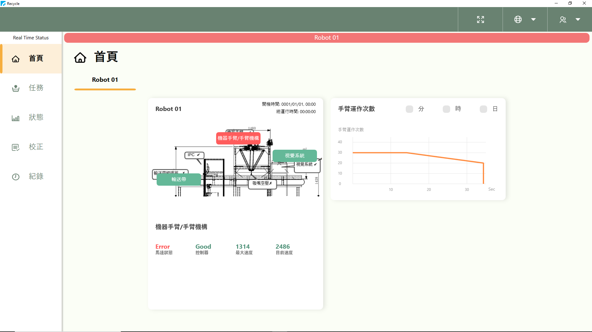
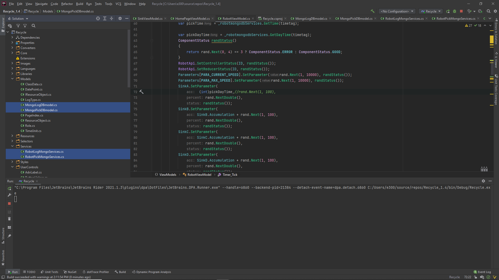

# WPF Pet-Robot UI with MongoDB (CRUD) 

WPF UI 存取 MongoDB 的 CRUD 範例專案。

### WPF UI Main Page

### mongo db 2 structure ::=> model / services



## 背景資訊

以簡單的 WPF UI 做基本 MongoDB CRUD 的存取示範。

* .NET MongoDB Driver 的版本相容資訊
  * 2.7 版 才支援 MongoDB 4.0。

### 專案的執行環境

* Visual Studio 2019
* .NET Core 3.0/3.1
* Mongo.Driver 2.7 or above
* MongoDB 4 (Docker)

## 安裝 MongoDB.Driver

安裝最新版，今時今日為版本 2.7.0。

* 至 [NuGet 套件管理員] 搜尋 "MongoDB.Driver" 並安裝。  

  或
* 至 [套件管理主控台] 執行
    ```
    Install-Package MongoDB.Driver
    ```
## 使用 Mongo DB Service, 以 Collection 做 Create/Read

### Create PET=='P' / PET='Other' / PET='Color' / ...


## 參考資料及圖片來源

1. [C# and .NET MongoDB Driver](https://docs.mongodb.com/ecosystem/drivers/csharp/)
2. [C# 搭配 MongoDB 的連線寫法](https://blog.yowko.com/mongodb-connectionstring/)
3. [Update all properties of object in MongoDb](https://stackoverflow.com/questions/30893012/update-all-properties-of-object-in-mongodb)
4. [Docker版MongoDB的安裝](https://www.jianshu.com/p/2181b2e27021)
